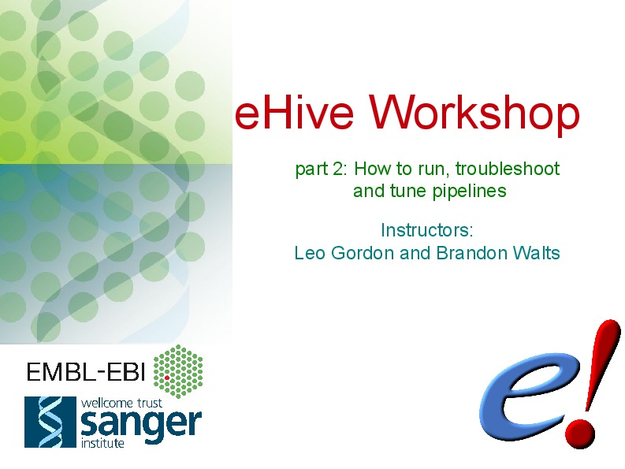
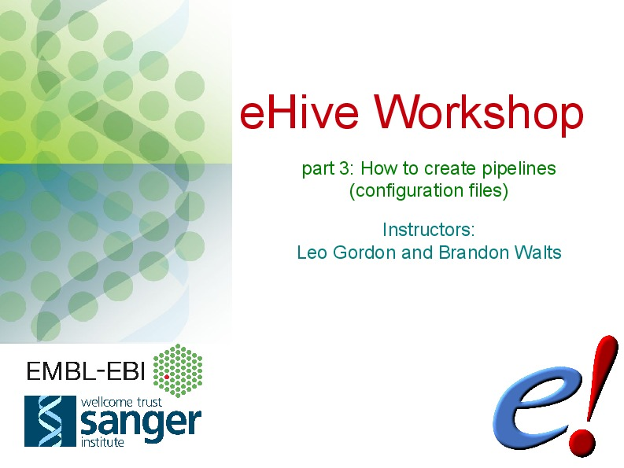
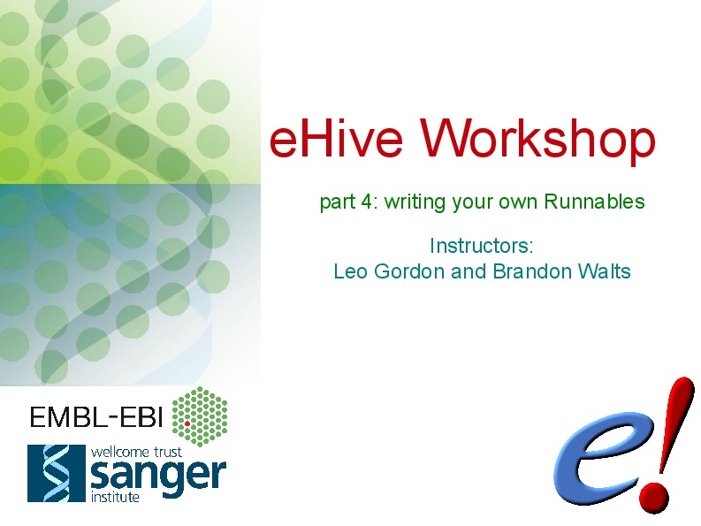

Presentations & Workshop materials
----------------------------------

March 2017, Roslin Institute
~~~~~~~~~~~~~~~~~~~~~~~~~~~~

.. Trick: the images have to be available at compilation time and can't
   have whitespace in their names. The paths must thus be valid from the
   current directory. However, the targets are not copied over by default.
   They are only copied over by adding them to html_extra_dir, which
   changes the path.

.. image:: ../presentations/HiveWorkshop_Mar2017/Workshop_introduction.jpg
   :target: ../HiveWorkshop_Mar2017/Workshop%20introduction.pdf

