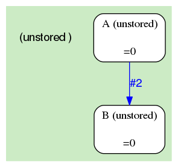
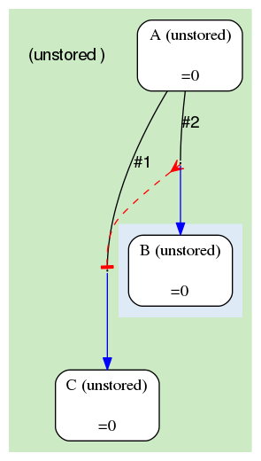

# Common dataflows

## Index

1. [Autoflow](#100)  
  a. [Autoflow](#101)  
  b. [Autoflow v2](#102)  
  c. [Autoflow v3](#103)  
2. [Factory](#200)  
  a. [Factory](#201)  
  b. [Factory with semaphored funnel](#202)  

## <a name='100'></a>Autoflow

<em>Autoflow</em> is the default connection between consecutive analyses


### <a name='101'></a>Autoflow

Default dataflow pattern from A to B, also called <em>autoflow</em>. This happens on branch #1. Each A job will flow a B job.

```
{   -logic_name => 'A',
    -flow_into  => {
       1 => [ 'B' ],
    },
},
{   -logic_name => 'B',
},
```


### <a name='102'></a>Autoflow v2

Same as above, but more concise.

```
{   -logic_name => 'A',
    -flow_into  => [ 'B' ],
},
{   -logic_name => 'B',
},
```


### <a name='103'></a>Autoflow v3

Same as above, but even more concise

```
{   -logic_name => 'A',
    -flow_into  => 'B'
},
{   -logic_name => 'B',
},
```


## <a name='200'></a>Factory

Autoflow can only create 1 job. To create more than 1 jobs, you can use <em>factory</em> patterns.


### <a name='201'></a>Factory

Analysis A fans 0, 1 or many jobs to analysis B. The convention is to use branch #2. A is called the <em>factory</em>, B the <em>fan</em>.

```
{   -logic_name => 'A',
    -flow_into  => {
       2 => [ 'B' ],
    },
},
{   -logic_name => 'B',
},
```


### <a name='202'></a>Factory with semaphored funnel

Analysis A fans 0, 1 or many jobs to analysis B. It also autoflows 1 job to C, which is initially blocked. The latter will be released once all the B jobs (and their descendants, if any) are done. C is called the <em>funnel</em>.

```
{   -logic_name => 'A',
    -flow_into  => {
       '2->A' => [ 'B' ],
       'A->1' => [ 'C' ],
    },
},
{   -logic_name => 'B',
},
{   -logic_name => 'C',
},
```


