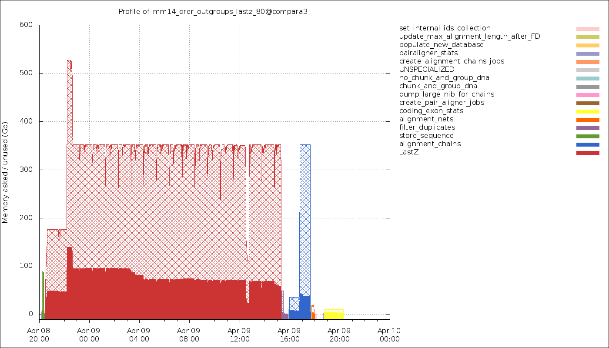
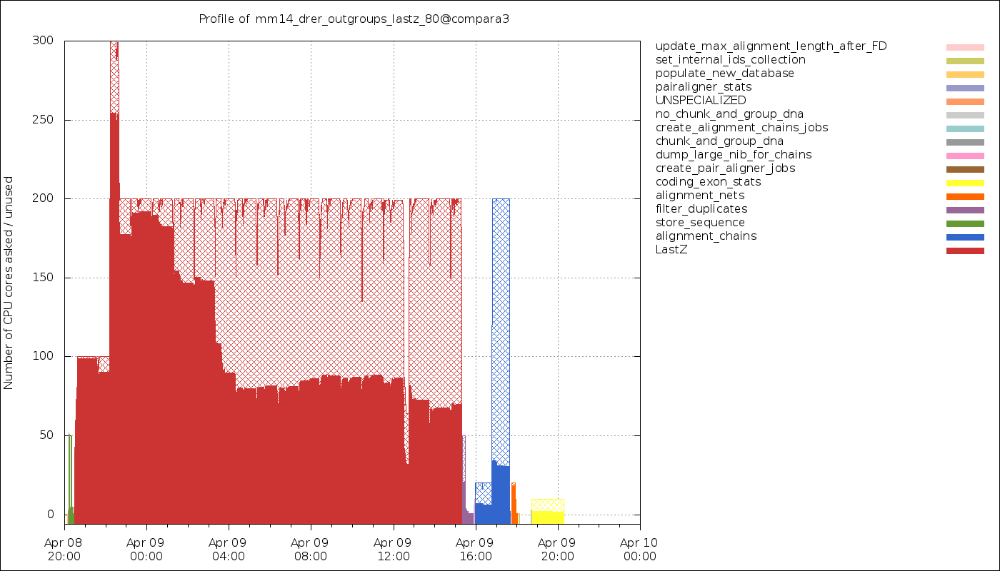

.. eHive guide to running pipelines: managing running pipelines

Tools and techniques for managing running pipelines
===================================================

eHive has an internal accounting system to help it efficiently allocate Workers
and schedule Jobs. In normal operation, the Beekeeper updates the status of
eHive components and internal statistics on an intermittent basis, without the
need for intervention from the user. However, in some cases this accounting will
not update correctly - usually when the user circumvents eHive's automated
operation. There are some utility functions available via the Beekeeper to
correct these accounting discrepancies.

Synchronizing ("sync"-ing) the pipeline database
------------------------------------------------

There are a number of Job counters maintained by the eHive system to
help it manage the Worker population, monitor progress, and correctly
block and unblock Analyses. These counters are updated periodically, in
a process known as synchronization (or "sync").

The sync process can be computationally expensive in large pipelines, so
syncs are only performed when needed.

Rarely, the Job counters will become incorrect during abnormal pipeline
operation, for example if a few process crash, or after Jobs are manually
stopped and re-run. In this case, the user may want to manually re-sync the
database. This is done by running ``beekeeper.pl`` with the -sync option:

::

            beekeeper.pl -url sqlite:///my_pipeline_database -sync

Re-balancing semaphores
-----------------------

When a group of Jobs is organized into a fan and funnel structure, the eHive
system keeps track of how many fan Jobs are not :hivestatus:`<DONE>[ DONE ]` or
[ PASSED_ON ]. When that count reaches zero, the semaphore controlling the
funnel Job is released. In some abnormal circumstances, for example when Workers
are killed without an opportunity to exit cleanly, eHive's internal count of
Jobs remaining to do before releasing the semaphore may not represent reality.
Resetting Jobs in a fan is another scenario that can cause the semaphore count
to become incorrect. It is possible to force eHive to re-count fan Jobs and
update semaphores by running ``beekeeper.pl`` with the -balance_semaphores option:

::

           beekeeper.pl -url sqlite:///my_pipeline_database -balance_semaphores

.. _garbage-collection:

Garbage collection of dead Workers
----------------------------------

On occasion, Worker processes will end without having an opportunity to update
their status in the eHive database. The Beekeeper will attempt to find these
Workers and update their status itself. It does this by reconciling the list of
Worker statuses in the eHive database with information on Workers gleaned from
the meadow's process tables (e.g. ``ps``, ``bacct``, ``bjobs``). This
process is called "garbage collection". A typical output is like this::

    Beekeeper : loop #12 ======================================================
    GarbageCollector:       Checking for lost Workers...
    GarbageCollector:       [Queen:] out of 66 Workers that haven't checked in during the last 5 seconds...
    GarbageCollector:       [LSF/EBI Meadow:]       RUN:66

In this case, 66 LSF workers had not updated their status within the last 5
seconds but they were in fact all running and listed by ``bjobs``. The
Garbage collection process ends there, then.

In another case, Beekeeper could find so called ``LOST`` Workers::

    Beekeeper : loop #15 ======================================================
    GarbageCollector:       Checking for lost Workers...
    GarbageCollector:       [Queen:] out of 45 Workers that haven't checked in during the last 5 seconds...
    GarbageCollector:       [LSF/EBI Meadow:]       LOST:4, RUN:41

    GarbageCollector:       Discovered 4 lost LSF Workers
    LSF::parse_report_source_line( "bacct -l '4126850[15]' '4126850[6]' '4126835[24]' '4126850[33]'" )
    GarbageCollector:       Found why 4 of LSF Workers died

In this case, ``bjobs`` only listed 41 of the 45 LSF workers that had not
updated their status within the last 5 seconds. Beekeeper then had to
resort to ``bacct`` to find out what happened to 4 ``LOST`` Workers.
``LOST`` Workers are most of the time Workers that have been killed by LSF
due to exceeding their allocated resources (MEMLIMIT or RUNLIMIT).

The Garbage collection happens at every Beekeeper loop, but a manual
reconciliation and update of Worker statuses can be invoked by running
``beekeeper.pl`` with the -dead option:

::

          beekeeper.pl -url sqlite:///my_pipeline_database -dead

Tips for performance tuning and load management
-----------------------------------------------

Resource optimisation
+++++++++++++++++++++

eHive automaticaly gathers resource usage information about every
workers and stores that in the ``worker_resource_usage`` table. Although it
can be accessed directly, the ``resource_usage_stats`` view gives a nicer
summary for each analysis::

    > SELECT * FROM resource_usage_stats;
    +---------------------------+-------------+--------------------------+-------------+---------+--------------+--------------+--------------+---------------+---------------+---------------+
    | analysis                  | meadow_type | resource_class           | exit_status | workers | min_mem_megs | avg_mem_megs | max_mem_megs | min_swap_megs | avg_swap_megs | max_swap_megs |
    +---------------------------+-------------+--------------------------+-------------+---------+--------------+--------------+--------------+---------------+---------------+---------------+
    | create_tracking_tables(1) | LSF         | default(1)               | done        |       1 |      56.7109 |        56.71 |      56.7109 |          NULL |          NULL |          NULL |
    | MLSSJobFactory(2)         | LSF         | default_with_registry(5) | done        |       1 |      67.5625 |        67.56 |      67.5625 |          NULL |          NULL |          NULL |
    | count_blocks(3)           | LSF         | default_with_registry(5) | done        |       1 |      56.9492 |        56.95 |      56.9492 |          NULL |          NULL |          NULL |
    | initJobs(4)               | LSF         | default_with_registry(5) | done        |       1 |      66.6445 |        66.64 |      66.6445 |          NULL |          NULL |          NULL |
    | createChrJobs(5)          | LSF         | default_with_registry(5) | done        |       1 |      61.2188 |        61.22 |      61.2188 |          NULL |          NULL |          NULL |
    | createSuperJobs(6)        | LSF         | default_with_registry(5) | done        |       2 |      61.1992 |        61.20 |       61.207 |          NULL |          NULL |          NULL |
    | createOtherJobs(7)        | LSF         | crowd_with_registry(4)   | done        |       1 |      100.398 |       100.40 |      100.398 |          NULL |          NULL |          NULL |
    | dumpMultiAlign(8)         | LSF         | crowd(2)                 | done        |      52 |      108.848 |       695.60 |      1330.91 |          NULL |          NULL |          NULL |
    | emf2maf(9)                | LSF         | crowd(2)                 | done        |      46 |      58.3008 |       132.88 |      150.695 |          NULL |          NULL |          NULL |
    | compress(10)              | LSF         | default(1)               | done        |      17 |      58.1758 |        58.24 |      58.2695 |          NULL |          NULL |          NULL |
    | md5sum(11)                | LSF         | default(1)               | done        |       2 |      58.2227 |        58.23 |      58.2344 |          NULL |          NULL |          NULL |
    | move_maf_files(12)        | LSF         | default(1)               | done        |       1 |      58.1914 |        58.19 |      58.1914 |          NULL |          NULL |          NULL |
    | readme(13)                | LSF         | default_with_registry(5) | done        |       2 |      77.5859 |        83.13 |       88.668 |          NULL |          NULL |          NULL |
    | targz(14)                 | NULL        | default(1)               | NULL        |       1 |         NULL |         NULL |         NULL |          NULL |          NULL |          NULL |
    +---------------------------+-------------+--------------------------+-------------+---------+--------------+--------------+--------------+---------------+---------------+---------------+

In this example you can see how much memory each analysis used and decide
how much to allocate them, e.g. 100 Mb for most analyses, 200 Mb for
"createOtherJobs" and "emf2maf", and 1,500 Mb for "dumpMultiAlign".
However, it seems that the average memory usage of "dumpMultiAlign" is below
700 Mb, meaning that more than half of the requested memory could be wasted
each time.  You can get the actual breakdown with this query::

    > SELECT 100*CEIL(mem_megs/100) AS mem_megs, COUNT(*) FROM worker_resource_usage JOIN role USING (worker_id) WHERE analysis_id = 8 GROUP BY CEIL(mem_megs/100);
    +----------+----------+
    | mem_megs | COUNT(*) |
    +----------+----------+
    |      200 |        1 |
    |      300 |        4 |
    |      400 |        6 |
    |      500 |       10 |
    |      600 |        9 |
    |      700 |        8 |
    |      800 |        5 |
    |      900 |        4 |
    |     1000 |        2 |
    |     1200 |        2 |
    |     1400 |        1 |
    +----------+----------+

You can see that about three quarters of the jobs used less than 700Mb, so
another strategy is to give 700Mb to the analysis, *expect* some jobs to
fail (i.e. to be killed by the compute farm) and wire a copy of the
analysis with more memory on the -1 branch (MEMLIMIT), cf
:ref:`resource-limit-dataflow`.  You can chain with MEMLIMIT as many
analyses as required to provide the appropriate memory usage steps, e.g.

.. hive_diagram::

    {   -logic_name => 'Alpha',
        -flow_into  => {
           -1 => [ 'Alpha_moremem' ],
        },
    },
    {   -logic_name => 'Alpha_moremem',
        -flow_into  => {
           -1 => [ 'Alpha_himem' ],
        },
    },
    {   -logic_name => 'Alpha_himem',
        -flow_into  => {
           -1 => [ 'Alpha_hugemem' ],
        },
    },
    {   -logic_name => 'Alpha_hugemem',
    },

Relying on MEMLIMIT can be inconvenient at times:

* The mechanism may not be available on all job schedulers (of the ones
  eHive support, only LSF has that functionality).
* When LSF kills the jobs, the open file handles and database connections
  are interrupted, potentially leading in corrupted data, and temporary
  files hanging around.
* Since the processes are killed in a *random* order and not atomically,
  sometimes, the child process (e.g. an external program your Runnable is
  running) will be killed first, and the Runnable will have enough time to
  record this job attempt as failed (but not as MEMLIMIT), take another job
  and *then* be killed, making eHive think it is the *second* job that has
  exceeded the memory requirement. On LSF we advice waiting 30 seconds when
  detecting that an external command has been killed to give LSF enough time to kill
  the worker too.
* This is time-expensive since a job may be tried with several memory
  requirements before finally finding the right one.

Instead of relying on MEMLIMIT, a more efficient approach is to predict the
amount of memory the job is going to need. You would first need to
understand what is causing the high memory usage, and try to correlate that to
some input parameters (for instance, the length of the chromosome, the
number of variants, etc). Then you can define several resource classes and
add ``WHEN`` conditions to the seeding dataflow to wire each job to the right
resource class.
Here is an example from an Ensembl Compara pipeline::

    -flow_into => {
        "2->A" => WHEN (
                    "(#total_residues_count# <= 3000000)                                          || (#dnafrag_count# <= 10)"                            => "pecan",
                    "(#total_residues_count#  > 3000000)  && (#total_residues_count# <= 30000000) && (#dnafrag_count#  > 10) && (#dnafrag_count# <= 25)" => "pecan_mem1",
                    "(#total_residues_count#  > 30000000) && (#total_residues_count# <= 60000000) && (#dnafrag_count#  > 10) && (#dnafrag_count# <= 25)" => "pecan_mem2",
                    "(#total_residues_count#  > 3000000)  && (#total_residues_count# <= 60000000) && (#dnafrag_count#  > 25)"                            => "pecan_mem2",
                    "(#total_residues_count#  > 60000000)                                         && (#dnafrag_count#  > 10)"                            => "pecan_mem3",
                  ),
        "A->1" => [ "update_max_alignment_length" ],
    },

Resource usage overview
+++++++++++++++++++++++

The data can also be retrieved with the :ref:`generate_timeline.pl
<script-generate_timeline>` script in the form of a graphical representation::

  generate_timeline.pl --url $EHIVE_URL --mode memory -output timeline_memory_usage.png
  generate_timeline.pl --url $EHIVE_URL --mode cores -output timeline_cpu_usage.png

    Timeline of the memory usage. The hatched areas represent the amount of
    memory that has been requested but not used.

Since eHive forces you to bin jobs into a smaller number of analyses, each
analysis having a single resource class (a memory requirement), each job
may not run with the exact amount of memory it needs. Some level of memory
over-reservation **is** expected (although the plot above shows too much of
that !).

    Timeline of the CPU usage. The hatched areas represent the fraction of
    the wall time spent on sleeping or waiting (for I/O, for instance).

It is most of the time expected to not be fully using the CPUs, as most
jobs will have to read some input data and write some results. both of
which subject to I/O waits. You also need to consider that all the SQL
queries you will be sending to a database server (either directly or via an
Ensembl API) will shift the focus to the server and make your own Runnable
wait for the result.
Finally, many job schedulers (such as LSF) can
only allocate whole CPU cores, meaning that even if you estimate you only
need 50% of a core, you might be forced to still allocate 1 core and
"waste" the other 50%.

.. _capacity-and-batch-size:

Capacity and batch size
+++++++++++++++++++++++

A number of parameters can help increasing the performance of a pipeline,
but capacities and batch sizes have the most direct effect. Both parameters
go hand in hand.

Although Workers run Jobs one at a time, they can request (claim) more than
one Job (a *batch*) from the database. It means a Worker would successively
have:

 * :math:`n` Jobs claimed, 0 running, 0 done
 * :math:`n`-1 Jobs claimed, 1 running, 0 done
 * :math:`n`-1 Jobs claimed, 0 running, 1 done
 * :math:`n`-2 Jobs claimed, 1 running, 1 done
 * :math:`n`-2 Jobs claimed, 0 running, 2 done
 * etc.

It is useful as long as claiming :math:`n` Jobs at a time is faster than
claiming :math:`n` times 1 Job, and that the claiming process doesn't lock
the table for too long (which would prevent other Workers from operating
normally).

This can mitigate the overhead of submitting many small, fast-running Jobs
to the farm.  Bear in mind that increasing the batch size helps relieving
the pressure on the Job table from claiming Jobs *only*. As the Job table
is used to track the current status of jobs, it can also be slowed down by
running too many Workers, regardless of the batch size. And more generally,
the Jobs may create additional load on other databases, filesystems, etc,
which are *your* responsibility to monitor.

Optimizing the batch size is something of an art, as the optimal size is a
function of Job runtime and the number of Jobs in contention for the eHive
database.  Here follows some estimates of the optimal parameters to run a
single Analysis, composed of 1 million Jobs, under two scenarios:

 * Best *throughput*: the combination of parameters that gets all the Jobs
   done the fastest.
 * Best *efficiency*: the combination of parameters that has the highest
   capacity whilst maintaining an overhead per Job below 10 milliseconds.
   The overhead is defined as the average amount of time eHive spends per
   Job for general housekeeping tasks, but also for claiming. For instance,
   a Worker that has lived 660 seconds and run 600 Jobs (each set to sleep
   1 second) will have an overhead of 10 millisecond per Job. eHive has a
   minimum overhead per Job of 6-7 milliseconds.

In general, "best throughput" parameters put a lot more pressure on the
database. Only use these parameters if you are in a rush to get your
Analysis done, and if you are allowed to use that much resources from the
server (the server might be unable to run someone else's pipeline at the
same time !).

+------------------+----------+-------------+-------------------+----------+------------+-----------------+-------------------+
| Job's duration   | Best efficiency                            | Best throughput                                             |
+                  +----------+-------------+-------------------+----------+------------+-----------------+-------------------+
|                  | Capacity | Batch size  | Analysis duration | Capacity | Batch size | Job overhead    | Analysis duration |
+==================+==========+=============+===================+==========+============+=================+===================+
| 50 ms            | 25       | 20 to 1,000 | 2,315 s           | 100      | 200        | 58 ms (116%)    | 1,080 s           |
+------------------+----------+-------------+-------------------+----------+------------+-----------------+-------------------+
| 100 ms           | 50       | 20 to 1,000 | 2,185 s           | 100      | 200        | 22 ms (22%)     | 1,215 s           |
+------------------+----------+-------------+-------------------+----------+------------+-----------------+-------------------+
| 500 ms           | 100      | 10 to 500   | 5,085 s           | 250      | 100        | 16 ms (3.2%)    | 2,055 s           |
+------------------+----------+-------------+-------------------+----------+------------+-----------------+-------------------+
| 1 s              | 250      | 10 to 50    | 4,040 s           | 500      | 50         | 257 ms (25.7%)  | 2,515 s           |
+------------------+----------+-------------+-------------------+----------+------------+-----------------+-------------------+
| 5 s              | 500      | 20          | 10,020 s          | 2,500    | 20         | 545 ms (10.9%)  | 2,220 s           |
+------------------+----------+-------------+-------------------+----------+------------+-----------------+-------------------+

These values have been determined with a pipeline entirely
made of *Dummy* Jobs (they just sleep for a given amount of time) at
various capacities (1, 5, 10, 25, 50, 100, 200 or 250, 500, 1,000, 2,500, 5,000)
and batch sizes (1, 2, 5, 10, 20, 50, 100, 200, 500, 1,000, 2,000, 5,000),
for various sleep times. The notion of sleep models operations on other
databases (data processing with the Ensembl API, for instance), running a
system command, etc.  Although the
actual results are specific to the MySQL server used for the benchmark, the
trend is expected to be the same on other versions of MySQL.

Hive capacity vs Analysis capacity
++++++++++++++++++++++++++++++++++

*Analysis capacity*

    Limits the number of Workers that ``beekeeper.pl`` will run for this particular Analysis.
    It does not mean if you set it to 200 there will be exactly 200 workers of this Analysis,
    as there are other considerations taken into account by the scheduler, but there will be
    no more than 200.

*hive capacity*

    Also limits the number of Workers, but globally across the whole pipeline.
    If you set -hive_capacity of an Analysis to X it will mean "one Worker of this Analysis
    consumes 1/X of the whole Hive's capacity (which equals to 1.0)". Like
    Analysis capacity, setting it to 200 means that you will not get more
    than 200 running Workers.
    Using it only makes sense if you need several Analyses running in
    parallel and consuming the same resource (e.g. accessing the same
    table) to balance load between themselves.

If one of these is set to 0, eHive will not schedule any Workers for the
Analysis (regardless of the value of the other parameter). If a parameter
is not set (undefined), then its related limiter is unused.

Examples
~~~~~~~~

analysis_capacity=0 and hive_capacity is not set:

  No Workers are allowed to run

analysis_capacity=0 and hive_capacity=150:

  No Workers are allowed to run

analysis_capacity is not set and hive_capacity=0:

  No Workers are allowed to run

analysis_capacity is not set and hive_capacity=150:

  No Workers are allowed to run

analysis_capacity=150 and hive_capacity is not set:

  eHive will schedule at most 150 Workers for this Analysis

A.hive_capacity=1 and B.hive_capacity=300. Examples of allowed numbers of Workers are:

  +------------+------------+
  | Analysis A | Analysis B |
  +============+============+
  | 1          | 0          |
  +------------+------------+
  | 0          | 300        |
  +------------+------------+

A.hive_capacity=100, A.analysis_capacity=1 and B.hive_capacity=300. Examples of allowed numbers of Workers are:

  +------------+------------+
  | Analysis A | Analysis B |
  +============+============+
  | 1          | 297        |
  +------------+------------+
  | 0          | 300        |
  +------------+------------+

A.hive_capacity=100 and B.hive_capacity=300. Examples of allowed numbers of Workers are:

  +------------+------------+
  | Analysis A | Analysis B |
  +============+============+
  | 100        | 0          |
  +------------+------------+
  | 75         | 75         |
  +------------+------------+
  | 50         | 150        |
  +------------+------------+
  | 25         | 225        |
  +------------+------------+
  | 0          | 300        |
  +------------+------------+

A.hive_capacity=100, B.hive_capacity=300 and B.analysis_capacity=210. Examples of allowed numbers of Workers are:

  +------------+------------+
  | Analysis A | Analysis B |
  +============+============+
  | 100        | 0          |
  +------------+------------+
  | 75         | 75         |
  +------------+------------+
  | 50         | 150        |
  +------------+------------+
  | 30         | 210        |
  +------------+------------+

More efficient looping
++++++++++++++++++++++

The Beekeeper is not constantly active: it works a bit, up to several seconds
depending on the size and complexity of the pipeline, and the
responsiveness of the job scheduler, and then sleeps for a given amount of
time (by default 1 minute, the ``-sleep`` parameter).  Every loop, the Beekeeper
submits ``-submit_workers_max`` Workers (which defaults to 50), to avoid
overloading the scheduler with submitted Jobs.

You can change both parameters, for instance reduce the sleep time to submit
Workers more frequently (e.g. 12 seconds == 0.2 minutes), or increase
``-submit_workers_max`` to submit more Workers every loop (e.g.  100 or
200) as long as the server supports it.  It is good practice to give
Workers time to check-in with the eHive database between loops. The default
parameters are safe values that generally work well for production
pipelines.

The impact of loop time on the overall time to complete a workflow
will be fairly small, however. When a Worker completes a Job, it looks
for new Jobs that it can run, and will claim and run them automatically
- the Beekeeper is not involved in this claiming process. It's only in
the case where new Workers need to be created that the pipeline would
be waiting for another Beekeeper loop.

Other limiters
++++++++++++++

Besides the Analysis-level capacities, the number of running Workers is
limited by the ``TotalRunningWorkersMax`` parameter. This parameter has a
default value in the a hive_config.json file in the root of the eHive
directory and can be changed at the Beekeeper level with the ``--total_running_workers_max`` option.

Every time the Beekeeper loops, it will check the current state of your
eHive pipeline and the number of currently running Workers. If it
determines more Workers are needed, and the ``-total_running_workers_max``
value hasn't been reached, it will submit more, up to the limit of
``-submit_workers_max``.

Database server choice and configuration
++++++++++++++++++++++++++++++++++++++++

SQLite can have issues when multiple processes are trying to access the
database concurrently because each process acquires locks the whole
database. As a result, it behaves poorly when the number of workers
reaches a dozen or so.

MySQL is better at those scenarios and can handle hundreds of concurrent
active connnections. In our experience, the most important parameters of
the server are the amount of RAM available and the size of the `InnoDB
Buffer Pool <https://dev.mysql.com/doc/refman/5.7/en/innodb-buffer-pool.html>`_.

We have only used PostgreSQL in small-scale tests. If you get the chance to
run large pipelines on PostgreSQL, let us know ! We will be interested
in hearing how eHive behaves.

Database connections
++++++++++++++++++++

The Ensembl codebase does, by default, a very poor job at managing database
connections, and how to solve the "MySQL server has gone away" error is a
recurrent discussion thread.  Even though eHive's database connections
themselves are in theory immune to this error, Runnables often use the
Ensembl connection mechanism via various Ensembl APIs and might still get
into trouble.  The Core API especially has two evil parameters:

* ``disconnect_when_inactive`` (boolean). When set the API will
  disconnect after every single query. This can result in exhausting the
  pool of ports available on the worker's machine, leading to *all*
  processes on this machine failing to open a network connection. You can
  spot this when MySQL fails with the error code 99 (*Cannot assign
  requested address*). Leave this one to zero unless you use other
  mechanisms such as ``prevent_disconnect`` to prevent this from happening
  (see below).

* ``reconnect_when_lost`` (boolean). When set the API will ping the server
  before *every* query, which is expensive.

There are however some useful methods and tools in the Core API:

* ``disconnect_if_idle``. This method will ask the DBConnection object to
  disconnect from the database if possible (i.e. if the connection is not
  used for anything). Simple, but it does the job. Use this when you're
  done with a database.

* ``prevent_disconnect``. This method will run a piece of code with
  ``disconnect_when_inactive`` unset. Together they can form a clean way of
  handling database connections:

    1. Set ``disconnect_when_inactive`` generally to 1 -- This works as
       long as the database is used for just one query once in a while.
    2. Use ``prevent_disconnect`` blocks when you're going to use the
       database for multiple, consecutive, queries.

  This way, the connection is only open when it is needed, and closed the
  rest of the time.

* ``ProxyDBConnection``. In Ensembl, a database connection is bound to one
  database only. However data can be spread across multiple databases on
  the same server (e.g. the Ensembl live MySQL server), and the API is
  going to create one connection for each database, potentially quickly
  exhausting the number of connections available, and the API is going to
  create one connection for each database, potentially quickly exhausting
  the number of connections available. ``ProxyDBConnection`` is a way of
  pooling multiple database connections to the same server within the same
  object (connection). See an example in the `Ensembl-compara API
  <https://github.com/Ensembl/ensembl-compara/blob/release/93/modules/Bio/EnsEMBL/Compara/Utils/CoreDBAdaptor.pm#L73-L109>`__.
