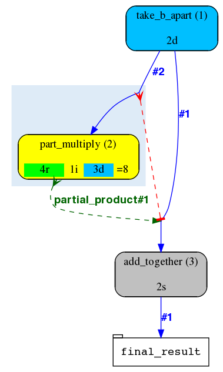

.. eHive guide to running pipelines: monitoring your pipeline, and identifying trouble

Tools for monitoring your pipeline
==================================

Monitoring the progress via guiHive
-----------------------------------

GuiHive is a web interface to an eHive database that allows monitoring
the state of the pipeline. It displays flow diagrams of all the steps in
the pipeline and their relationship to one another. In addition it
colours Analyses based on completion and each Analysis has a progress
circle which indicates the number of complete, running and failed Jobs.
GuiHive also offers the ability to directly modify Analyses, for example
you can change the Resource Class used by the Analysis directly through
guiHive.

GuiHive is already installed at the
`Sanger <http://guihive.internal.sanger.ac.uk:8080/>`__ and at the
`EBI <http://guihive.ebi.ac.uk:8080/>`__ (both for internal use only),
but can also be installed locally. Instructions for this are on
`GitHub <https://github.com/Ensembl/guiHive>`__

Generating a pipeline's flow diagram
------------------------------------

The :ref:`generate_graph.pl <script-generate_graph>` script is another 
visualization tool available in eHive. It can be useful for producing diagrams 
when guiHive is unavailable or cannot connect to the eHive database. 
To produce a diagram from an eHive database, run:

::

            generate_graph.pl -url sqlite:///my_pipeline_database -out my_diagram.png

You can choose the format (gif, jpg, png, svg, etc.) by setting the output file
extension.

|example\_diagram|

Legend:

-  The rounded nodes on the flow diagram represent Analyses (classes of
   Jobs).
-  The white rectangular nodes represent tables that hold user data.
-  The blue solid arrows are called "dataflow rules". They either
   generate new Jobs (if they point to an Analysis node) or store data
   (if they point at a table node).
-  The red solid arrows with T-heads are "analysis control rules". They
   block the pointed-at Analysis until all the Jobs of the pointing
   Analysis are done.
-  Light-blue shadows behind some analyses stand for :ref:`"semaphore rules" <semaphores-detail>`.
   Together with red and green dashed lines they represent our main Job
   control mechanism that will be described elsewhere.

Each flow diagram thus generated is a momentary snapshot of the pipeline
state, and these snapshots will be changing as the pipeline runs. One of
the things changing will be the colour of the Analysis nodes. The
default colour legend is as follows:

-  :hivestatus:`<EMPTY>[ EMPTY ]` : the Analysis never had any Jobs to do. Since pipelines
   are dynamic it may be OK for some Analyses to stay EMPTY until the
   very end.
-  :hivestatus:`<DONE>[ DONE ]` : all Jobs of the Analysis are DONE. Since pipelines are
   dynamic, it may be a temporary state, until new Jobs are added.
-  :hivestatus:`<READY>[ READY ]` : some Jobs are READY to be run, but nothing is running
   at the moment.
-  :hivestatus:`<INPROGRESS>[ IN PROGRESS ]` : some Jobs of the Analysis are being processed at
   the moment of the snapshot.
-  :hivestatus:`<BLOCKED>[ BLOCKED ]` : none of the Jobs of this Analysis can be run at the
   moment because of Job dependency rules.
-  :hivestatus:`<FAILED>[ FAILED ]` : the number of FAILED Jobs in this Analysis has gone
   over a threshold (which is 0 by default). By default ``beekeeper.pl``
   will exit if it encounters a FAILED Analysis.

Another thing that will be changing from snapshot to snapshot is the Job
"breakout" formula displayed under the name of the Analysis. It shows
how many Jobs are in which state and the total number of Jobs. Separate
parts of this formula are similarly colour-coded:

-  :hivestatus:`<SEMAPHORED> __s (SEMAPHORED)` - individually blocked Jobs
-  :hivestatus:`<READY> __r (READY)` - Jobs that are ready to be claimed by Workers
-  :hivestatus:`<INPROGRESS> __i (IN PROGRESS)` - Jobs that are currently being processed
   by Workers
-  :hivestatus:`<DONE> __d (DONE)` - successfully completed Jobs
-  :hivestatus:`<FAILED> __f (FAILED)` - unsuccessfully completed Jobs

``generate_graph.pl`` can also create a diagram directly from a PipeConfig file, with no
pipeline database needed:

::

            generate_graph.pl -pipeconfig Bio::EnsEMBL::Hive::Examples::LongMult::PipeConfig::LongMult_conf -out my_diagram2.png

Such a "standalone" diagram may look slightly different (analysis_ids
will be missing).

Monitoring the progress via a direct database session
-----------------------------------------------------

In addition to monitoring the visual flow diagram (that could be
generated manually using
``generate_graph.pl`` or via the
guiHive web interface), you can also connect to the pipeline database
directly and issue SQL commands. To avoid typing in all the connection
details (syntax is different depending on the particular database engine
used) you can use a bespoke :ref:`db_cmd.pl <script-db_cmd>`
script that takes the eHive database URL and performs the connection for
you:

::

    db_cmd.pl -url $EHIVE_URL

Once connected, you can list the tables and views with ``SHOW TABLES;``.
The default set of tables should look something like:

::

    +----------------------------+
    | Tables_in_hive_pipeline_db |
    +----------------------------+
    | accu                       |
    | analysis_base              |
    | analysis_ctrl_rule         |
    | analysis_data              |
    | analysis_stats             |
    | analysis_stats_monitor     |
    | dataflow_rule              |
    | hive_meta                  |
    | job                        |
    | job_file                   |
    | log_message                |
    | msg                        |
    | pipeline_wide_parameters   |
    | progress                   |
    | resource_class             |
    | resource_description       |
    | resource_usage_stats       |
    | role                       |
    | worker                     |
    | worker_resource_usage      |
    +----------------------------+

Some of these tables, such as ``analysis_base``, ``job`` and
``resource_class`` may be populated with entries depending on what is in
you configuration file. At the very least you should expect to have your
analyses in ``analysis_base``. Some tables such as ``log_message`` will
only get populated while the pipeline is running (for example
``log_message`` will get an entry when a Job exceeds the memory limit
and dies).

Please refer to the eHive schema (see `eHive schema
diagram <hive_schema.png>`__ and `eHive schema
description <hive_schema.html>`__) for details on these tables and
their relations.

In addition to the tables, there is a "progress" view which summarizes the
progression of work across the Analyses in a pipeline:

::

            SELECT * from progress;

If you see Jobs in :hivestatus:`<FAILED>[ FAILED ]` state or Jobs with
retry\_count > 0 (which means they have failed at least once and had
to be retried), you may need to look at the "msg" view in order to
find out the reason for the failures:

::

            SELECT * FROM msg WHERE job_id=1234;    # a specific Job

or

::

            SELECT * FROM msg WHERE analysis_id=15; # Jobs of a specific Analysis

or

::

            SELECT * FROM msg;  # show me all messages

Some of the messages indicate temporary errors (such as temporary lack
of connectivity with a database or file), but some others may be
critical (wrong path to a binary) that will eventually make all Jobs of
an Analysis fail. If the "is\_error" flag of a message is false, it may
be just a diagnostic message which is not critical.

Monitoring the progress via guiHive
-----------------------------------

GuiHive is a web-interface to a eHive database that allows to monitor
the state of the pipeline. It displays flow diagrams of all the steps in
the pipeline and their relationship to one another. In addition it
colours Analyses based on completion and each Analysis has a progress
circle which indicates the number of complete, running and failed Jobs.
guiHive also offers the ability to directly modify analyses, for example
you can change the Resource Class used by the Analysis directly through
guiHive.

guiHive is already installed at the
`Sanger <http://guihive.internal.sanger.ac.uk:8080/>`__ and at the
`EBI <http://guihive.ebi.ac.uk:8080/>`__ (both for internal use only),
but can also be installed locally. Instructions for this are on
`GitHub <https://github.com/Ensembl/guiHive>`__

