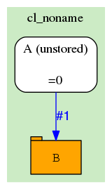
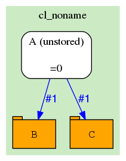
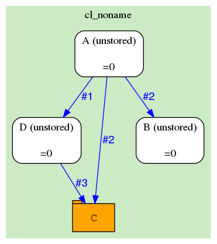
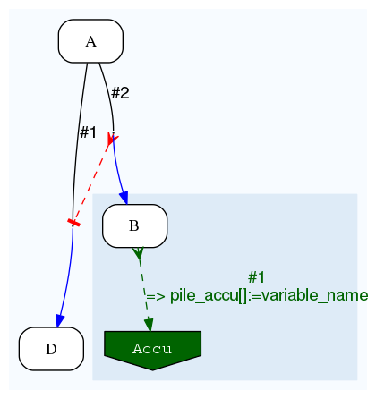

Dataflow targets
================

.. contents::

Analysis
--------

In eHive, a job can create another job via a Dataflow event by wiring the branch to another analysis.

Dataflow to one analysis
~~~~~~~~~~~~~~~~~~~~~~~~

This is what we have used in the Dataflow document. Simply name the target analysis after the ``=>``.

::

    {   -logic_name => 'A',
        -flow_into  => {
           1 => [ 'B' ],
        },
    },
    {   -logic_name => 'B',
    },

.. figure:: dataflow_targets/101.png

Dataflow to multiple analyses
~~~~~~~~~~~~~~~~~~~~~~~~~~~~~

A branch can actually be connected to multiple analyses. When a Dataflow
event happens, it will create a job in each of them.

::

    {   -logic_name => 'A',
        -flow_into  => {
           1 => [ 'B', 'C' ],
        },
    },
    {   -logic_name => 'B',
    },
    {   -logic_name => 'C',
    },

.. figure:: dataflow_targets/102.png

Multiple dataflows to the same analysis
~~~~~~~~~~~~~~~~~~~~~~~~~~~~~~~~~~~~~~~

Reciprocally, an analysis can be the target of several branches coming
from the same analysis.
Here, jobs are created in B whenever there is an event on branch #2, in C
when there is an event on branch #2 or #3, and D when there is an event on branch #1.

::

    {   -logic_name => 'A',
        -flow_into  => {
           2 => [ 'B', 'C' ],
           3 => [ 'C' ],
           1 => [ 'D' ],
        },
    },
    {   -logic_name => 'B',
    },
    {   -logic_name => 'C',
    },
    {   -logic_name => 'D',
    },

.. figure:: dataflow_targets/103.png

Table
-----

A job can store data in a table via the Dataflow mechanism instead of raw SQL access.

Dataflow to one analysis
~~~~~~~~~~~~~~~~~~~~~~~~

This is what we have used in the Dataflow document. Simply name the target analysis after the ``=>``
with a URL that contains the ``table_name`` key. URLs can be *degenerate*, i.e. skip the part before
the question mark (like below) or *completely defined*, i.e. start with ``driver://user@host/database_name``.

::

    {   -logic_name => 'A',
        -flow_into  => {
           1 => [ '?table_name=B' ],
        },
    },

Dataflow to multiple tables
~~~~~~~~~~~~~~~~~~~~~~~~~~~

A branch can actually be connected to multiple tables. When a Dataflow
event happens, it will create a row in each of them.

::

    {   -logic_name => 'A',
        -flow_into  => {
           1 => [ '?table_name=B', '?table_name=C' ],
        },
    },

Multiple dataflows to tables and analyses
~~~~~~~~~~~~~~~~~~~~~~~~~~~~~~~~~~~~~~~~~

An analysis can dataflow to multiple targets, both of analysis and table types.

Rows inserted by table-dataflows are usually not linked to the emitting job_id.
In the example below, a row from the table C will typically not have information
about the analysis (job) that generated it.
This can however be enabled by explicitly adding the job_id to the dataflow payload.

::

    {   -logic_name => 'A',
        -flow_into  => {
           2 => [ 'B', '?table_name=C' ],
           1 => [ 'D' ],
        },
    },
    {   -logic_name => 'B',
    },
    {   -logic_name => 'D',
        -flow_into  => {
           3 => [ '?table_name=C' ],
        },
    },

Accumulator
-----------

The last type of dataflow-target is called as an *accumulator*. It is a way of passing data from *fan* jobs
to their *funnel*.

Single accumulator
~~~~~~~~~~~~~~~~~~

An accumulator is defined with a special URL that contains the ``accu_name`` key. There are five types
of accumulators (scalar, pile, multiset, array and hash), all described in :doc:`accumulators`.

Accumulators can **only** be connected to *fan* analyses of a semaphore group. All the data flown into them
is *accumulated* and passed on to the *funnel* once the latter is released.

::

    {   -logic_name => 'A',
        -flow_into  => {
           '2->A' => [ 'B' ],
           'A->1' => [ 'D' ],
        },
    },
    {   -logic_name => 'B',
        -flow_into  => {
           1 => [ '?accu_name=pile_accu&accu_input_variable=variable_name&accu_address=[]' ],
        },
    },
    {   -logic_name => 'D',
    },

Multiple accumulators and semaphore propagation
~~~~~~~~~~~~~~~~~~~~~~~~~~~~~~~~~~~~~~~~~~~~~~~

During the semaphore propagation, more jobs are added to the current semaphore-group
in order to block the current funnel. Similarly a funnel may receive data from multiple
accumulators (possibly fed by different analyses) of a semaphore-group.

::

    {   -logic_name => 'A',
        -flow_into  => {
           '2->A' => [ 'B' ],
           'A->1' => [ 'D' ],
        },
    },
    {   -logic_name => 'B',
        -flow_into  => {
           2 => [ 'C' ],
           1 => [ '?accu_name=pile_accu&accu_input_variable=variable_name&accu_address=[]' ],
        },
    },
    {   -logic_name => 'C',
        -flow_into  => {
           1 => [ '?accu_name=multiset_accu&accu_input_variable=variable_name&accu_address={}' ],
        },
    },
    {   -logic_name => 'D',
    }

.. figure:: dataflow_targets/302.png

