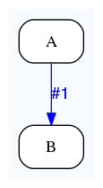
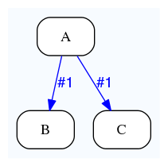
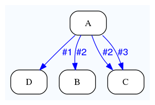

Dataflow-target patterns
========================

Dataflow to an analysis
-----------------------

In eHive, a job can create another job via a Dataflow event by wiring the branch to another analysis.

Dataflow to one analysis
~~~~~~~~~~~~~~~~~~~~~~~~

This is what we have used in the Dataflow document. Simply name the target analysis after the ``=>``.

::

    {   -logic_name => 'A',
        -flow_into  => {
           1 => [ 'B' ],
        },
    },
    {   -logic_name => 'B',
    },

Dataflow to multiple analyses
~~~~~~~~~~~~~~~~~~~~~~~~~~~~~

A branch can actually be connected to multiple analyses. When a Dataflow
event happens, it will create a job in each of them.

::

    {   -logic_name => 'A',
        -flow_into  => {
           1 => [ 'B', 'C' ],
        },
    },
    {   -logic_name => 'B',
    },
    {   -logic_name => 'C',
    },

Multiple dataflows to the same analysis
~~~~~~~~~~~~~~~~~~~~~~~~~~~~~~~~~~~~~~~

Reciprocally, an analysis can be the target of several branches coming
from the same analysis.
Here, jobs are created in B whenever there is an event on branch #2, in C
when there is an event on branch #2 or #3, and D when there is an event on branch #1.

::

    {   -logic_name => 'A',
        -flow_into  => {
           2 => [ 'B', 'C' ],
           3 => [ 'C' ],
           1 => [ 'D' ],
        },
    },
    {   -logic_name => 'B',
    },
    {   -logic_name => 'C',
    },
    {   -logic_name => 'D',
    },

