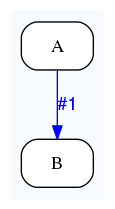
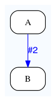
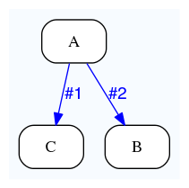

Common dataflows
================

Autoflow
--------

*Autoflow* is the default connection between consecutive analyses

Autoflow
~~~~~~~~

Default dataflow pattern from A to B, also called *autoflow*. This happens on branch #1. Each A job will flow a B job.

::

    {   -logic_name => 'A',
        -flow_into  => {
           1 => [ 'B' ],
        },
    },
    {   -logic_name => 'B',
    },

.. figure:: dataflows/101.png

Autoflow v2
~~~~~~~~~~~

Same as above, but more concise.

::

    {   -logic_name => 'A',
        -flow_into  => [ 'B' ],
    },
    {   -logic_name => 'B',
    },

.. figure:: dataflows/102.png

Autoflow v3
~~~~~~~~~~~

Same as above, but even more concise

::

    {   -logic_name => 'A',
        -flow_into  => 'B'
    },
    {   -logic_name => 'B',
    },

Factory
-------

Autoflow can only create 1 job. To create more than 1 jobs, you can use *factory* patterns.

Factory
~~~~~~~

Analysis A fans 0, 1 or many jobs to analysis B. The convention is to use branch #2. A is called the *factory*, B the *fan*.

::

    {   -logic_name => 'A',
        -flow_into  => {
           2 => [ 'B' ],
        },
    },
    {   -logic_name => 'B',
    },

Factory with semaphored funnel
~~~~~~~~~~~~~~~~~~~~~~~~~~~~~~

Analysis A fans 0, 1 or many jobs to analysis B. It also autoflows 1 job to C, which is initially blocked. The latter will be released once all the B jobs (and their descendants, if any) are done. C is called the *funnel*.

::

    {   -logic_name => 'A',
        -flow_into  => {
           '2->A' => [ 'B' ],
           'A->1' => [ 'C' ],
        },
    },
    {   -logic_name => 'B',
    },
    {   -logic_name => 'C',
    },

