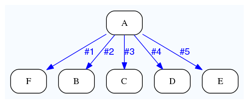
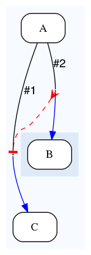
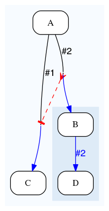
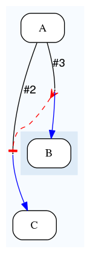
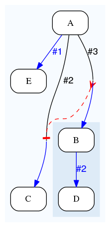

Common dataflows
================

Autoflow
--------

*Autoflow* is the default event that happens between consecutive analyses

Autoflow
~~~~~~~~

Upon success, each job from A will generate a Dataflow event on branch #1, which is connected to branch B. This is called
*autoflow* as jobs seem to automatically flow from A to B.

::

    {   -logic_name => 'A',
        -flow_into  => {
           1 => [ 'B' ],
        },
    },
    {   -logic_name => 'B',
    },

.. figure:: dataflows/101.png

Autoflow v2
~~~~~~~~~~~

Same as above, but more concise.

::

    {   -logic_name => 'A',
        -flow_into  => [ 'B' ],
    },
    {   -logic_name => 'B',
    },

.. figure:: dataflows/102.png

Autoflow v3
~~~~~~~~~~~

Same as above, but even more concise

::

    {   -logic_name => 'A',
        -flow_into  => 'B'
    },
    {   -logic_name => 'B',
    },

.. figure:: dataflows/103.png

Custom, independent, dataflows
------------------------------

The autoflow mechanism only triggers 1 event, and only upon completion. To create more events, or under different circumstances,
you can use *factory* patterns.

Factory
~~~~~~~

Analysis A triggers 0, 1 or many Dataflow events on branch #2 (this is the convention for non-autoflow events).
In this pattern, A is called the *factory*, B the *fan*.

::

    {   -logic_name => 'A',
        -flow_into  => {
           2 => [ 'B' ],
        },
    },
    {   -logic_name => 'B',
    },

.. figure:: dataflows/201.png

Factory in parallel of the autoflow
~~~~~~~~~~~~~~~~~~~~~~~~~~~~~~~~~~~

In the above example, nothing was connected to the branch #1 of analysis A. The default *autoflow* event
was thus lost. You can in fact have both branches connected.

An analysis can use multiple branches at the same time and for instance produce a fan of jobs on branch #2
*and* still a job on branch #1. Both stream of jobs (B and C) are executed in parallel.

::

    {   -logic_name => 'A',
        -flow_into  => {
           2 => [ 'B' ],
           1 => [ 'C' ],
        },
    },
    {   -logic_name => 'B',
    },
    {   -logic_name => 'C',
    },

.. figure:: dataflows/202.png

Factory with a funnel
~~~~~~~~~~~~~~~~~~~~~

There are virtually no restrictions on the number of branches that can be used.
They however have to be integers, preferably positive integers for the sake of
this tutorial as negative branch numbers have a special meaning (which will be
addressed further down this document).

::

    {   -logic_name => 'A',
        -flow_into  => {
           2 => [ 'B' ],
           3 => [ 'C' ],
           4 => [ 'D' ],
           5 => [ 'E' ],
           1 => [ 'F' ],
        },
    },
    {   -logic_name => 'B',
    },
    {   -logic_name => 'C',
    },
    {   -logic_name => 'D',
    },
    {   -logic_name => 'E',
    },
    {   -logic_name => 'F',
    },

Dependent dataflows and semaphores
----------------------------------

eHive allows to group multiple branch definitions to create job dependencies.

Factory
~~~~~~~

Analysis A triggers 0, 1 or many Dataflow events on branch #2 (this is the convention for non-autoflow events).
In this pattern, A is called the *factory*, B the *fan*.

::

    {   -logic_name => 'A',
        -flow_into  => {
           2 => [ 'B' ],
        },
    },
    {   -logic_name => 'B',
    },

Factory in parallel of the autoflow
~~~~~~~~~~~~~~~~~~~~~~~~~~~~~~~~~~~

In the above example, nothing was connected to the branch #1 of analysis A. The default *autoflow* event
was thus lost.

An analysis can use multiple branches at the same time and for instance produce a fan of jobs on branch #2
*and* still a job on branch #1. Both stream of jobs (B and C) are executed in parallel.

::

    {   -logic_name => 'A',
        -flow_into  => {
           2 => [ 'B' ],
           1 => [ 'C' ],
        },
    },
    {   -logic_name => 'B',
    },
    {   -logic_name => 'C',
    },

Factory with a funnel
~~~~~~~~~~~~~~~~~~~~~

Dataflow events can be grouped with the ``->`` operator.

``2->A`` means that all the Dataflow events on branch #2 have to be grouped together
in a group named **A**. Note that this name **A** is not related to the name of the
analysis. Group names are single-letter codes, meaning that eHive allows up to 26 groups
for each analysis.

``A->1`` means that the job resulting from the Dataflow event on branch #1 (the _autoflow_)
has to wait for *all* the jobs in group **A** before it can start.

This pattern is called a _semaphore_, and C is called the _funnel_ analysis.

::

    {   -logic_name => 'A',
        -flow_into  => {
           '2->A' => [ 'B' ],
           'A->1' => [ 'C' ],
        },
    },
    {   -logic_name => 'B',
    },
    {   -logic_name => 'C',
    },

Factory with a funnel
~~~~~~~~~~~~~~~~~~~~~

Jobs created by a job that is part of a semaphore group are
automatically added to the semaphore group.

In the example below, the job in C (the _funnel_) will have to
wait for all its controlling jobs in B to complete, but also all
the jobs these may have created in D as well.

This process is called _semaphore propagation_.

::

    {   -logic_name => 'A',
        -flow_into  => {
           '2->A' => [ 'B' ],
           'A->1' => [ 'C' ],
        },
    },
    {   -logic_name => 'B',
        -flow_into  => {
           2 => [ 'D' ],
        },
    },
    {   -logic_name => 'C',
    },
    {   -logic_name => 'D',
    },

