.. _long-multiplication-walkthrough:

========================================
Long Multiplication pipeline walkthrough
========================================

0.  .. rubric:: This is a walkthrough of a simple 3-analysis example
       pipeline.
       :name: this-is-a-walkthrough-of-a-simple-3-analysis-example-pipeline.

    The goal of the pipeline is to multiply two long numbers. We pretend
    that it cannot be done in one operation on a single machine. So we
    decide to split the task into subtasks of multiplying the first long
    number by individual digits of the second long number for the sake
    of an example. At the last step the partial products are shifted and
    added together to yield the final product.

    We demonstrate what happens in the pipeline with the help of two
    types of diagrams: job-level dependency (J-)diagrams and
    analysis-rule (A-)diagrams:

    +--------------------------------------+--------------------------------------+
    | A **J-diagram** is a directed        | An **A-diagram** is a directed graph |
    | acyclic graph where nodes represent  | where most of the nodes represent    |
    | Jobs, Semaphores or Accumulators     | Analyses and edges represent Rules.  |
    | with edges representing              | As a whole it represents the         |
    | relationships and dependencies. Most | structure of the pipeline which is   |
    | of these objects are created         | normally static. The only changing   |
    | dynamically during the pipeline      | elements will be job counts and      |
    | execution, so here you'll see a lot  | analysis colours.                    |
    | of action - the J-diagram will be    |                                      |
    | growing.                             | A-diagrams can be generated at any   |
    |                                      | moment during a pipeline's execution |
    | J-diagrams can be generated at any   | by running Hive's                    |
    | moment during a pipeline's execution | **generate\_graph.pl** script        |
    | by running Hive's                    |                                      |
    | **visualize\_jobs.pl** script (new   |                                      |
    | in version/2.5)                      |                                      |
    +--------------------------------------+--------------------------------------+

    |

    | The main bulk of this document is a commented series of snapshots
      of both types of diagrams during the execution of the pipeline.
    | They can be approximately reproduced by running a sequence of
      commands, similar to these, in a terminal:

    ::

            export PIPELINE_URL=sqlite:///lg4_long_mult.sqlite                                                               # An SQLite file is enough to handle this pipeline

            init_pipeline.pl Bio::EnsEMBL::Hive::Examples::LongMult::PipeConfig::LongMult_conf -pipeline_url $PIPELINE_URL   # Initialize the pipeline database from a PipeConfig file

            runWorker.pl -url $PIPELINE_URL -job_id $JOB_ID                                                                  # Run a specific job - this allows you to force your own order of execution. Run a few of these

            beekeeper.pl -url $PIPELINE_URL -analyses_pattern $ANALYSIS_NAME -sync                                           # Force the system to recalculate job counts and determine states of analyses

            visualize_jobs.pl -url $PIPELINE_URL -out long_mult_jobs_${STEP_NUMBER}.png                                      # To make a J-diagram snapshot (it is convenient to have synchronized numbering)

            generate_graph.pl -url $PIPELINE_URL -out long_mult_analyses_${STEP_NUMBER}.png                                  # To make an A-diagram snapshot (it is convenient to have synchronized numbering)

--------------

1.  .. rubric:: This is our pipeline just after the initialization:
       :name: this-is-our-pipeline-just-after-the-initialization

    +--------------------------+--------------------------+--------------------------+
    | |image0|                 |                          | |image1|                 |
    +--------------------------+--------------------------+--------------------------+
    | The J-diagram shows a    |                          | The A-diagram shows how  |
    | couple of 3d-boxes, they |                          | execution of the         |
    | represent specific Jobs. |                          | pipeline is guided by    |
    | Each Job is an           |                          | Rules. Since the Rules   |
    | individual task that can |                          | are mostly static, the   |
    | be run on an individual  |                          | diagram will also be     |
    | machine. We need at      |                          | changing very little.    |
    | least one initial Job to |                          |                          |
    | run a pipeline. However  |                          | The main objects on      |
    | that one Job may         |                          | A-diagram are rectangles |
    | generate many more as it |                          | with rounded corners,    |
    | gets executed.           |                          | they represent Analyses. |
    |                          |                          | Analyses are "types" of  |
    | In this example we have  |                          | Jobs (Analyses broadly   |
    | two initial Jobs. They   |                          | define which code to     |
    | were created             |                          | run, where and how, but  |
    | automatically during the |                          | miss specific parameters |
    | pipeline's               |                          | which become defined in  |
    | initialization process.  |                          | Jobs). In this pipeline  |
    | These two initial Jobs   |                          | we have three types:     |
    | will generate two        |                          | 'take\_b\_apart',        |
    | independent "streams" of |                          | 'part\_multiply' and     |
    | execution which will     |                          | 'add\_together'.         |
    | yield their own          |                          |                          |
    | independent results.     |                          | The "take\_b\_apart"     |
    | Since in this particular |                          | Analysis contains two    |
    | pipeline we are simply   |                          | Jobs, which are in       |
    | multiplying same two     |                          | 'READY' state (can be    |
    | numbers in different     |                          | checked-out for          |
    | orders, we expect the    |                          | execution). Our colour   |
    | final results to be      |                          | for 'READY' is green, so |
    | identical.               |                          | both the Analysis and    |
    |                          |                          | the specific Jobs are    |
    |                          |                          | shown in green.          |
    +--------------------------+--------------------------+--------------------------+

--------------

2.  .. rubric:: After running the first Job we see a lot of changes on
       the J-diagram:
       :name: after-running-the-first-job-we-see-a-lot-of-changes-on-the-j-diagram

    +--------------------------+--------------------------+--------------------------+
    | |image2|                 |                          | |image3|                 |
    +--------------------------+--------------------------+--------------------------+
    | Job\_1 has finished      |                          | The topology of          |
    | running and is now in    |                          | A-diagram doesn't        |
    | 'DONE' state             |                          | normally change, so pay  |
    | (colour-coded blue). It  |                          | attention at more subtle |
    | has generated 6 more     |                          | changes of colours and   |
    | Jobs: five in Analysis   |                          | labels:                  |
    | 'part\_multiply'         |                          |                          |
    | (splitting its own task  |                          | -  'take\_b\_apart'      |
    | into parts) and one in   |                          |    analysis is now       |
    | Analysis 'add\_together' |                          |    yellow (in progress); |
    | (which will recombine    |                          |    *"1r+1d" stands for   |
    | the results of the       |                          |    "1 READY and 1 DONE"* |
    | former into the final    |                          | -  'part\_multiply'      |
    | result).                 |                          |    analysis is now green |
    |                          |                          |    (ready);              |
    | The newly created        |                          |    *"5r" means "5        |
    | 'part\_multiply' Jobs    |                          |    READY"*               |
    | also control a Semaphore |                          | -  'add\_together'       |
    | which blocks the         |                          |    analysis is now grey  |
    | 'add\_together' Job      |                          |    (all jobs are         |
    | which is in 'SEMAPHORED' |                          |    waiting);             |
    | state and cannot be      |                          |    *"1s" means "1        |
    | executed yet (grey). The |                          |    SEMAPHORED" (or       |
    | Semaphore is essentially |                          |    blocked).*            |
    | a counter that gets      |                          |                          |
    | decremented each time    |                          |                          |
    | one of the controlling   |                          |                          |
    | Jobs becomes 'DONE'. It  |                          |                          |
    | is our primary mechanism |                          |                          |
    | for synchronization of   |                          |                          |
    | control- and dataflow.   |                          |                          |
    +--------------------------+--------------------------+--------------------------+

3.  .. rubric:: After running the second Job more jobs have been added
       to Analyses 'part\_multiply' and 'add\_together'.
       :name: after-running-the-second-job-more-jobs-have-been-added-to-analyses-part_multiply-and-add_together.

    +--------------------------+--------------------------+--------------------------+
    | |image4|                 |                          | |image5|                 |
    +--------------------------+--------------------------+--------------------------+
    | There is a new           |                          | -  'take\_b\_apart'      |
    | Semaphore, a new group   |                          |    Analysis is completed |
    | of 'part\_multiply' Jobs |                          |    (no more Jobs to run) |
    | to control it, and a new |                          |    and turns blue        |
    | 'add\_together' Job      |                          |    ('DONE')              |
    | blocked by it.           |                          | -  more 'part\_multiply' |
    |                          |                          |    jobs have been        |
    | Note that the child jobs |                          |    generated, all are    |
    | sometimes inherit some   |                          |    'READY'               |
    | of their parameters from |                          | -  one more              |
    | their parent Job         |                          |    'add\_together' job   |
    | ("params from: 1",       |                          |    has been generated,   |
    | "params from: 2"). This  |                          |    and it is also        |
    | is done to save some     |                          |    'SEMAPHORED'          |
    | space.                   |                          |                          |
    +--------------------------+--------------------------+--------------------------+

    *Note that the job counts of A-diagram do not provide enough
    resolution to tell which Jobs are semaphored by which. Not even the
    distribution of the Jobs that control Semaphores. This is where
    J-diagram becomes useful.*

4.  .. rubric:: We finally get to run a Job from the second Analysis.
       :name: we-finally-get-to-run-a-job-from-the-second-analysis.

    +--------------------------+--------------------------+--------------------------+
    | |image6|                 |                          | |image7|                 |
    +--------------------------+--------------------------+--------------------------+
    | Once it's done, two      |                          |                          |
    | things happen:           |                          |                          |
    |                          |                          |                          |
    | -  one of the links to   |                          |                          |
    |    the Semaphore turns   |                          |                          |
    |    green and its counter |                          |                          |
    |    gets decremented by 1 |                          |                          |
    |    (control flow)        |                          |                          |
    | -  some data intended    |                          |                          |
    |    for the Job\_3 is     |                          |                          |
    |    sent from Job\_4 and  |                          |                          |
    |    arrives at an         |                          |                          |
    |    Accumulator (data     |                          |                          |
    |    flow).                |                          |                          |
    +--------------------------+--------------------------+--------------------------+

5.  .. rubric:: A couple more Jobs get executed with a similar effect
       :name: a-couple-more-jobs-get-executed-with-a-similar-effect

    +--------------------------+--------------------------+--------------------------+
    | |image8|                 |                          | |image9|                 |
    +--------------------------+--------------------------+--------------------------+
    | After executing these    |                          |                          |
    | two jobs:                |                          |                          |
    |                          |                          |                          |
    | -  the Semaphore counter |                          |                          |
    |    gets decremented by 2 |                          |                          |
    |    (by the number of     |                          |                          |
    |    completed jobs)       |                          |                          |
    | -  the data that they    |                          |                          |
    |    generated gets sent   |                          |                          |
    |    to the corresponding  |                          |                          |
    |    Accumulator.          |                          |                          |
    +--------------------------+--------------------------+--------------------------+

6.  .. rubric:: And another couple more Jobs...
       :name: and-another-couple-more-jobs...

    +-------------+-----+-------------+
    | |image10|   |     | |image11|   |
    +-------------+-----+-------------+

7.  .. rubric:: Finally, one of the Semaphores gets completely
       unblocked, which turns Job\_9 into 'READY' state.
       :name: finally-one-of-the-semaphores-gets-completely-unblocked-which-turns-job_9-into-ready-state.

    +--------------------------+--------------------------+--------------------------+
    | |image12|                |                          | |image13|                |
    +--------------------------+--------------------------+--------------------------+
    | To recap:                |                          | -  'add\_together'       |
    |                          |                          |    analysis has turned   |
    | -  Semaphores help us to |                          |    green, which means it |
    |    funnel multiple       |                          |    finally contains      |
    |    control sub-threads   |                          |    something 'READY' to  |
    |    into one thread of    |                          |    run                   |
    |    execution.            |                          | -  the label changed to  |
    | -  Accumulators help to  |                          |    '1s+1r', which stands |
    |    assemble multiple     |                          |    for "1 SEMAPHORED and |
    |    data sub-structures   |                          |    1 READY"              |
    |    into one data         |                          |                          |
    |    structure.            |                          |                          |
    |                          |                          |                          |
    | Their operation is       |                          |                          |
    | synchronized, so that    |                          |                          |
    | when a Semaphore opens   |                          |                          |
    | its Accumulators are     |                          |                          |
    | ready for consumption.   |                          |                          |
    +--------------------------+--------------------------+--------------------------+

8.  .. rubric:: Job\_9 gets executed.
       :name: job_9-gets-executed.

    +--------------------------+--------------------------+--------------------------+
    | |image14|                |                          | |image15|                |
    +--------------------------+--------------------------+--------------------------+
    | We can see that the      |                          | -  The results of Job\_9 |
    | stream of execution      |                          |    are deposited into    |
    | starting at Job\_2       |                          |    the 'final\_result'   |
    | finished first. In       |                          |    table.                |
    | general, there is no     |                          | -  Unlike Accumulators,  |
    | guarantee for the order  |                          |    'final\_result' is a  |
    | of execution of jobs     |                          |    pipeline-specific     |
    | that are in 'READY'      |                          |    non-Hive table, so no |
    | state.                   |                          |    link is retained      |
    |                          |                          |    between the job that  |
    |                          |                          |    generated the data    |
    |                          |                          |    and the data in the   |
    |                          |                          |    table.                |
    |                          |                          | -  There are no more     |
    |                          |                          |    runnable jobs in      |
    |                          |                          |    'add\_together'       |
    |                          |                          |    analysis, so it turns |
    |                          |                          |    grey again, with      |
    |                          |                          |    '1s+1d' label for "1  |
    |                          |                          |    SEMAPHORED and 1      |
    |                          |                          |    DONE"                 |
    +--------------------------+--------------------------+--------------------------+

9.  .. rubric:: The last 'part\_multiply' job gets run...
       :name: the-last-part_multiply-job-gets-run...

    +--------------------------+--------------------------+--------------------------+
    | |image16|                |                          | |image17|                |
    +--------------------------+--------------------------+--------------------------+
    | -  Once Job\_7 has run   |                          |                          |
    |    the second Semaphore  |                          |                          |
    |    gets unblocked.       |                          |                          |
    | -  This makes the second |                          |                          |
    |    Accumulator ready for |                          |                          |
    |    consumption and       |                          |                          |
    |    Job\_3 becomes        |                          |                          |
    |    'READY'.              |                          |                          |
    +--------------------------+--------------------------+--------------------------+

10. .. rubric:: Job\_3 gets executed.
       :name: job_3-gets-executed.

    +--------------------------+--------------------------+--------------------------+
    | |image18|                |                          | |image19|                |
    +--------------------------+--------------------------+--------------------------+
    | -  Finally, all the jobs |                          | The result also goes     |
    |    are 'DONE' (displayed |                          | into 'final\_result'     |
    |    in blue)              |                          | table. We can verify     |
    | -  The stream of         |                          | that the two results are |
    |    execution starting at |                          | identical.               |
    |    Job\_1 finished       |                          |                          |
    |    second (it could      |                          |                          |
    |    easily be the other   |                          |                          |
    |    way around).          |                          |                          |
    +--------------------------+--------------------------+--------------------------+

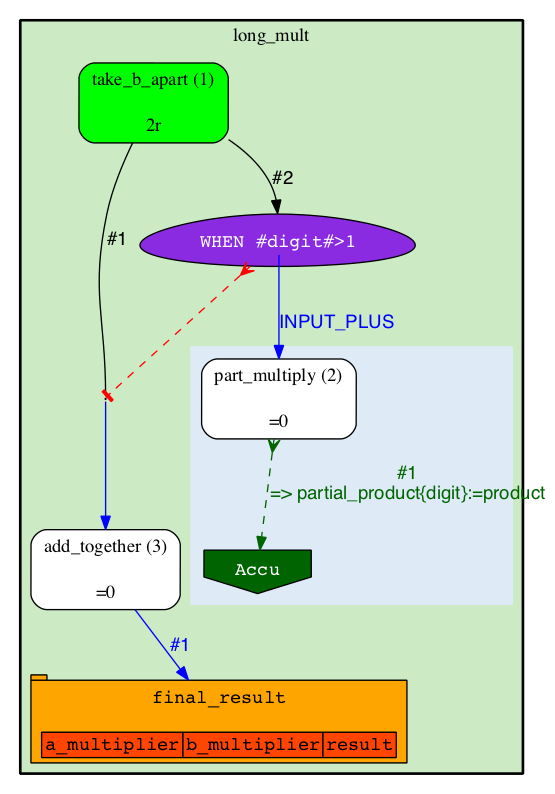
.. |image2| image:: walkthrough_diagrams/long_mult_jobs_02.png

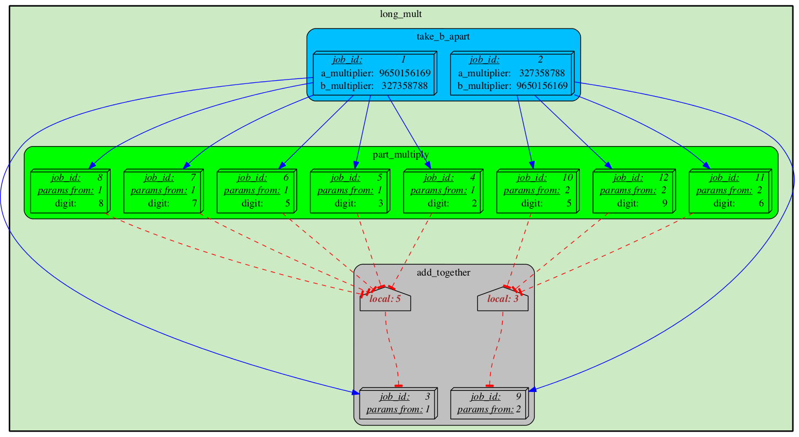
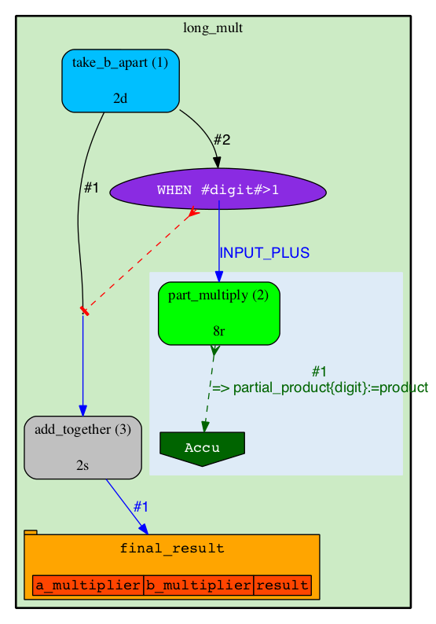
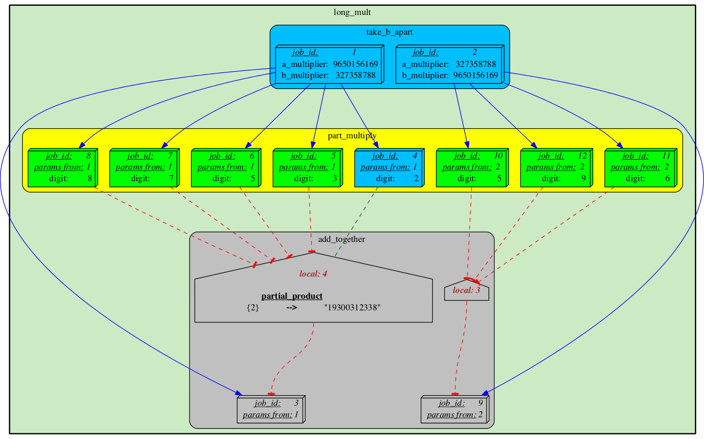

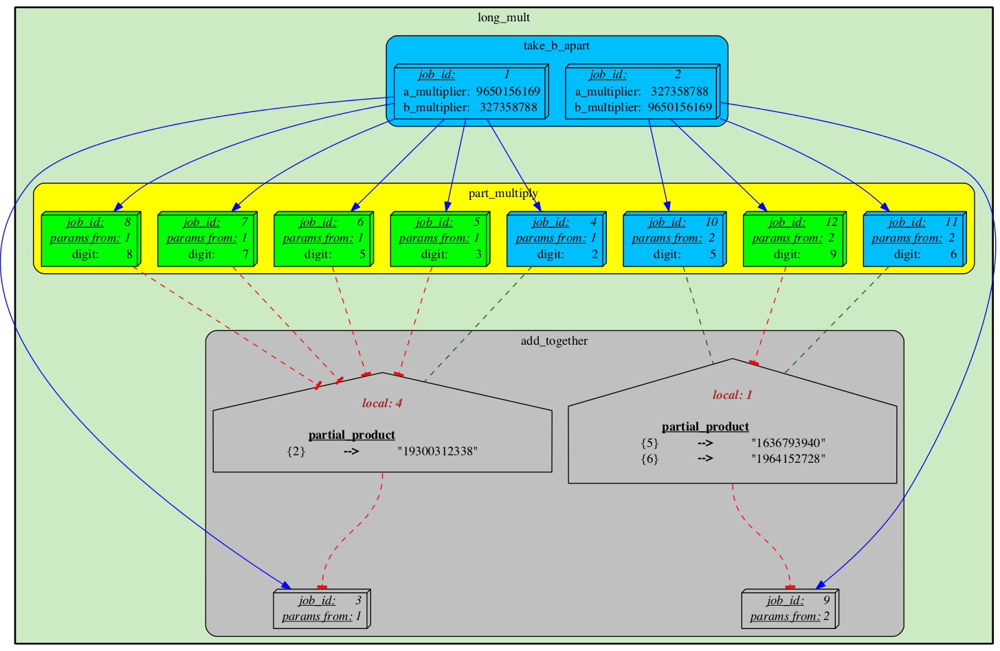
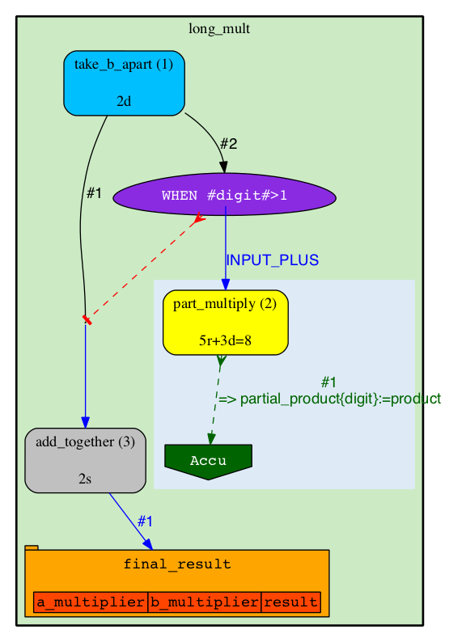
.. |image10| image:: walkthrough_diagrams/long_mult_jobs_06.png

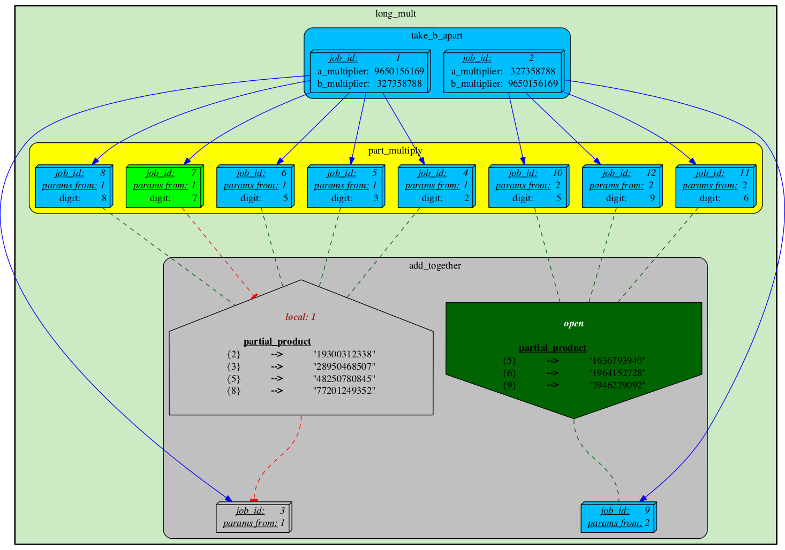
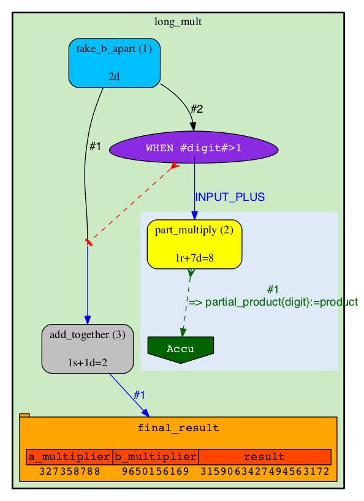
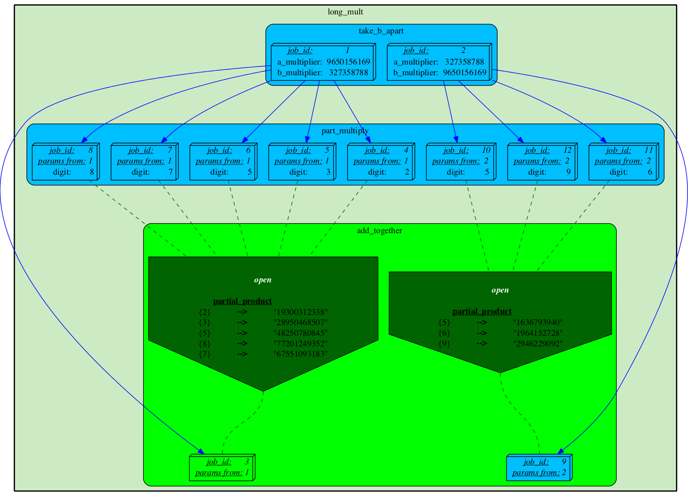
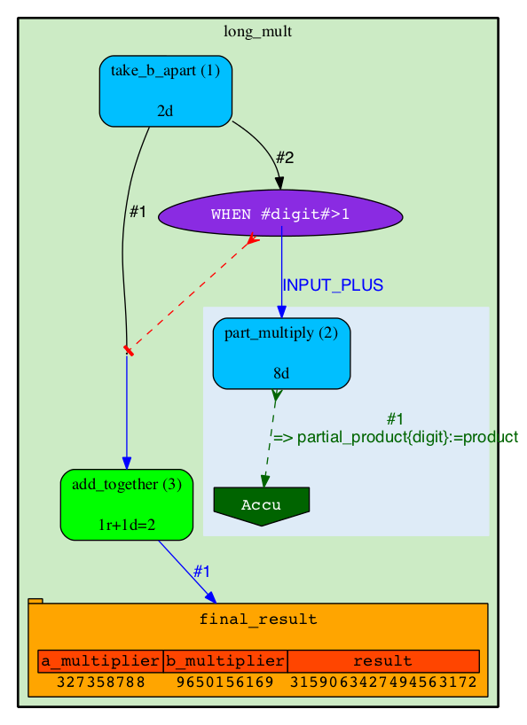
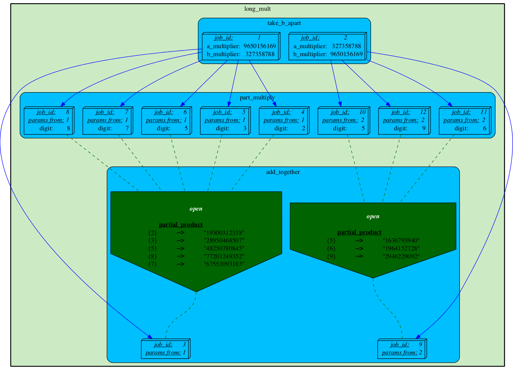

